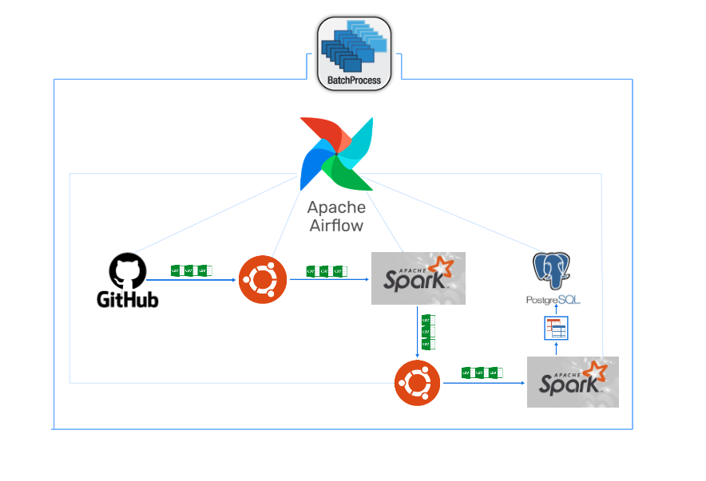

# Telecom Fraud Detection Pipeline

## Project Overview

### Industry Context  
Telecom fraud is a major concern in the industry, leading to revenue loss and security threats. Fraudulent activities such as high-frequency calls, short international calls, and excessive customer service interactions can indicate suspicious behavior. To combat this, telecom companies implement **data-driven fraud detection systems** that process and analyze Call Detail Records (CDRs) in real time or batches.

### Project Design & Industry Standards  
This project is designed as a **batch processing data pipeline** following industry-standard practices in **Data Engineering**. The pipeline extracts, processes, and loads CDR data efficiently while ensuring **scalability, logging, and error handling**. Key industry practices integrated into this project include:  

- **ELT-based approach**: Raw data is first loaded into the database, followed by transformation and analysis to detect fraudulent patterns.  
- **Scalability & Modularity**: The pipeline is designed to process large volumes of CDR data while allowing easy enhancements.  
- **Logging & Auditing**: Logs are maintained at each step, tracking file processing, rejections, and database updates.  
- **Error Handling & Data Validation**: Invalid or duplicate records are identified and stored in a separate rejection directory for future analysis.

## Architecture & Workflow  

### Data Flow Diagram  
The fraud detection pipeline follows a structured **batch processing workflow**, where CDR data is extracted, processed, and stored efficiently. Below is the high-level data flow:

#### **1. Extraction (Data Ingestion)**  
- CDR files are extracted from a **remote source (GitHub in this case, extendable to SFTP/cloud storage).**  
- The files are stored in a designated **landing directory** on the local system(ubuntu).  
- Audit logs are generated, tracking:
  - File names, record counts, duplicate counts, and processing timestamps.  

#### **2. Transformation (Fraud Detection & Data Validation)**  
- Extracted data is processed using **Apache Spark (PySpark)** for large-scale transformations.  
- Fraud detection rules are applied to identify suspicious patterns:
  - **High-frequency calls**  
  - **Short-duration international calls**  
  - **Excessive customer service interactions**  
  - **High total charge accumulation**
- More rules can be applied based on sourced data
- Processed records are **categorized into risk levels (Low, Medium, High)**.  
- Invalid or duplicate records are stored in a **separate rejection directory** for auditing.  
- The transformed data is **saved back as processed CSV files** in the local storage system(ubuntu) for further processing.

#### **3. Loading (Storage & Querying)**  
- Processed CDR files are **read using Apache Spark** and loaded into PostgreSQL.  
- Instead of directly inserting raw records into the database, Spark ensures:
  - **Performance & Speed**: Bulk inserts via Spark are **faster and more efficient** than row-by-row inserts in SQL.  
  - **Parallel processing** to speed up loading operations.  
  - **Handling Large Volumes**: Spark processes large datasets **in-memory**, reducing I/O overhead.  
  - **Error Handling & Recovery**: Spark allows checkpointing and **retry mechanisms** in case of failures.  
  - **Scalability**: The architecture can be **easily extended to a distributed setup** in a cloud environment
  - **Filtering & transformation** of final datasets before ingestion. 
- Audit logs capture every data load operation to maintain traceability.  

 **Why store transformed data as files before loading into a table?**  
- **Scalability & Performance**: Processing massive CDR datasets directly in a database increases complexity and can slow down performance. By handling transformations in **Spark** and 
    saving the output as files, we maintain efficiency.  
- **Modular & Extensible Design**: The processed files can be **reused for different purposes**, such as **feeding other systems**, **data warehousing**, or even **machine learning 
    models** in the future.  
- **Error Handling & Debugging**: If corruption or incorrect transformations occur, we can **trace the issue back to specific processed files** instead of modifying live database tables. 
- **Incremental Processing & Recovery**: In case of **partial failures**, we can **reprocess only affected files** without reloading the entire dataset, improving reliability.

### Entity Relationship Diagram (ERD)  
The **ERD for this project** reflects the database schema, capturing raw CDR details, fraud detection results, and audit logs.

### **Technologies Used**  
The pipeline integrates multiple technologies to ensure efficiency, scalability, and industry alignment:  
- **Apache Spark (PySpark)** – Large-scale data transformations & optimized batch processing.  
- **Apache Airflow** – Orchestration of extraction, processing, and loading tasks.  
- **PostgreSQL** – Structured storage for fraud detection results and analytics.   
- **Bash Scripting** – Automation of file management and logging mechanisms.
- **Ubuntu** - Operating system and local storage
- **pgAdmin4** - ERD generation
- **Lucidchart** - Used for Data flow diagram generation   

