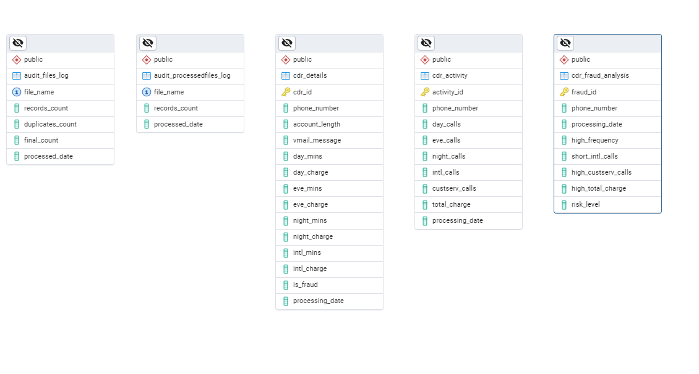
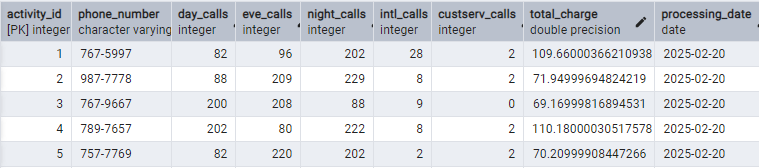
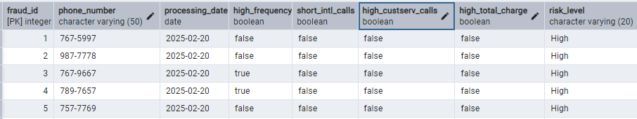
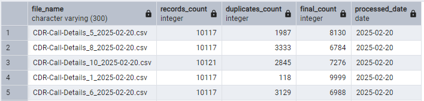
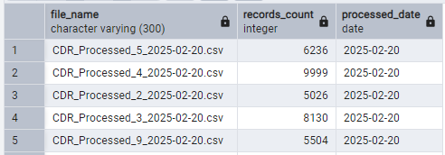

# Telecom Fraud Detection Pipeline

## Project Overview

### Industry Context  
Telecom fraud is a major concern in the industry, leading to revenue loss and security threats. Fraudulent activities, such as high-frequency and short-duration calls, indicate suspicious behavior. To combat this, telecom companies implement **data-driven fraud detection systems** that process and analyze Call Detail Records (CDRs) in real time or batches.

### Project Design & Industry Standards  
This project is designed as a **batch processing data pipeline** following industry-standard practices in **Data Engineering**. The pipeline extracts, processes, and loads CDR data efficiently while ensuring **scalability, logging, and error handling**. Key industry practices integrated into this project include:  

- **ELT-based approach**: Raw data is first loaded into the database, followed by transformation and analysis to detect fraudulent patterns.  
- **Scalability & Modularity**: The pipeline is designed to process large volumes of CDR data while allowing easy enhancements.  
- **Logging & Auditing**: Logs are maintained at each step, tracking file processing, rejections, and database updates.  
- **Error Handling & Data Validation**: Invalid or duplicate records are identified and stored in a separate rejection directory for future analysis.

## Architecture & Workflow  

### Data Flow Diagram  
The fraud detection pipeline follows a structured **batch processing workflow**, where CDR data is extracted, processed, and stored efficiently. Below is the high-level data flow:

#### **1. Extraction (Data Ingestion)**  
- CDR files are extracted from a **remote source (GitHub in this case, extendable to SFTP/cloud storage).**  
- The files are stored in a designated **landing directory** on the local system(ubuntu).  
- Audit logs are generated, tracking:
  - File names, record counts, duplicate counts, and processing timestamps.  

#### **2. Transformation (Fraud Detection & Data Validation)**  
- Extracted data is processed using **Apache Spark (PySpark)** for large-scale transformations.  
- Fraud detection rules are applied to identify suspicious patterns:
  - **High-frequency calls**  
  - **Short-duration international calls**  
  - **Excessive customer service interactions**  
  - **High total charge accumulation**
- Additional fraud rules can be implemented based on data sources.
- Processed records are **categorized into risk levels (Low, Medium, High)**.  
- Invalid or duplicate records are stored in a **separate rejection directory** for auditing.  
- The transformed data is **saved back as processed CSV files** in the local storage system(ubuntu) for further processing.

#### **3. Loading (Storage & Querying)**  
- Processed CDR files are **read using Apache Spark** and loaded into PostgreSQL.  
- Instead of directly inserting raw records into the database, Spark ensures:
  - **Performance & Speed**: Bulk inserts via Spark are **faster and more efficient** than row-by-row inserts in SQL.  
  - **Parallel processing** to speed up loading operations.  
  - **Handling Large Volumes**: Spark processes large datasets **in-memory**, reducing I/O overhead.  
  - **Error Handling & Recovery**: Spark allows checkpointing and **retry mechanisms** in case of failures.  
  - **Scalability**: The architecture supports scalability and can be deployed in a cloud-based distributed environment.
  - **Filtering & transformation** of final datasets before ingestion. 
- Audit logs capture every data load operation to maintain traceability.  

 **Why store transformed data as files before loading into a table?**  
- **Scalability & Performance**: Processing massive CDR datasets directly in a database increases complexity and can slow down performance. By handling transformations in **Spark** and 
    saving the output as files, we maintain efficiency.  
- **Modular & Extensible Design**: The processed files can be **reused for different purposes**, such as **feeding other systems**, **data warehousing**, or even **machine learning 
    models** in the future.  
- **Error Handling & Debugging**: If corruption or incorrect transformations occur, we can **trace the issue back to specific processed files** instead of modifying live database tables. 
- **Incremental Processing & Recovery**: In case of **partial failures**, we can **reprocess only affected files** without reloading the entire dataset, improving reliability.

### Entity Relationship Diagram (ERD)  
The **ERD for this project** reflects the database schema, capturing raw CDR details, fraud detection results, and audit logs.

### **Technologies Used**  
The pipeline integrates multiple technologies to ensure efficiency, scalability, and industry alignment:  
- **Apache Spark (PySpark)** – Large-scale data transformations & optimized batch processing.  
- **Apache Airflow** – Orchestration of extraction, processing, and loading tasks.  
- **PostgreSQL** – Structured storage for fraud detection results and analytics.   
- **Bash Scripting** – Automation of file management and logging mechanisms.
- **Ubuntu** - Operating system and local storage.
- **pgAdmin 4** - ERD generation.
- **Lucidchart** - Used for Data flow diagram generation.

## **1. Code Structure**  

The project is structured for modularity and efficiency:  

**Telecom_Data_Pipeline/** _(Root Directory)_  
 - **Scripts/** _(Contains Bash,SQL and Python scripts)_  
     - [Extract_CDR_Files.sh](Scripts/Extract_CDR_Files.sh) – Extracts CDR files from source.  
     - [Process_CDR_Files.py](Scripts/Process_CDR_Files.py) – PySpark script for transformations and fraud detection.  
     - [Move_Extracted_Files.sh](Scripts/Move_Extracted_Files.sh) – Moves extracted files to archive.
     - [Load_Audit_File_Data.sql](Scripts/Load_Audit_File_Data.sql) - Load audit file data into database.
     - [Create_Data_Objects.sql](Scripts/Create_Data_Objects.sql) - Creates the required tables in database.
     - [Load_CDR_Files.py](Scripts/Load_CDR_Files.py) - Load the processed files data in database.
     - [Load_Audit_ProcessedFile_Data.sql](Scripts/Load_Audit_ProcessedFile_Data.sql) - Load the processed files audit data in database.
 - **DAGs/** _(Airflow DAGs for orchestration)_  
     - [Telecome_pipeline.py](Dags/Telecome_pipeline.py) – Main DAG orchestrating the pipeline.  
 - **Logs/** _(Pipeline execution logs)_
     - [Success_sample.log](logs/Success_sample.log) - Sample log for a successful dag run.
     - [Failure_sample.log](logs/Failure_sample.log) - Sample log for failed dag run.
 - **Images/** _(Results_snippets)_    
 - **Docs/** _(Project documentation)_  
     - [Requirements_Document.docx](Documents/Requirements_Document.docx) – Lists required libraries & configurations.  
     - [Troubleshooting_Document.docx](Documents/Troubleshooting_Document.docx) – Covers common issues & fixes.
 - **CDRs/** _(Batch_files_Dataset)_
 - README.md – Project documentation.

## **2. DAGs & Execution Flow**  

### **Airflow DAG: `Telecome_pipeline.py`**  
The pipeline follows this sequence of tasks refer below dag graph in Airflow:

 **Task 1: Extract CDR Files (`BashOperator`)**  
  - Downloads raw CDR files to the local storage.  

 **Task 2: Process CDR Files (`SparkSubmitOperator`)**  
  - Runs the PySpark job to clean, transform, and detect fraud cases.

 **Task 3: Load Audit File Data (`PostgresOperator`)**  
  - Stores metadata about extracted files into an audit table.

 **Task 4: Move Extracted Files (`BashOperator`)**  
  - Moves successfully extracted files to an archive directory.  

 **Task 5: Create Data Objects (`PostgresOperator`)**  
  - Creates necessary tables in PostgreSQL if they don’t already exist.  

 **Task 6: Load CDR Files (`SparkSubmitOperator`)**  
  - Reads processed files and loads fraud detection results into PostgreSQL.  

 **Task 7: Load Audit Processed File Data (`PostgresOperator`)**  
  - Stores metadata about processed files into an audit table.  

 **Task 8: Move Processed Files (`BashOperator`)**  
  - Moves processed CDR files to an archive folder.  

## **3. Execution Flow (Step-by-Step)**  

### **Step 1: Extraction**  
- CDR files are extracted and stored in Source Directory.  
- Extraction is logged for tracking purposes.  

### **Step 2: Transformation & Fraud Detection**  
- PySpark processes raw CDR data to detect fraud.  
- Transformed data is stored in Processed directory.
- Rejected records are stored in Rejected data directory.  

### **Step 3: File Management & Auditing**  
- Extracted files are archived after processing.  
- Metadata about extracted and processed files is logged in PostgreSQL.  

### **Step 4: Loading into PostgreSQL**  
- Spark loads transformed CDR data into PostgreSQL.  
- Audit logs are updated for each processed file.  

### **Step 5: Logging & Monitoring**  
- Every step logs execution details for debugging and tracking.  

## **Sample Output & Insights**  

## **1. Processed Data Sample (PostgreSQL Output)**  
The following tables showcase the results after fraud detection processing.

**`cdr_details` Table (Raw CDR Data)**
- sql: SELECT * FROM cdr_details LIMIT 5;

  

**`cdr_activity` Table (Call Behavior Metrics)**
- sql: SELECT * FROM cdr_activity LIMIT 5;

  

**`cdr_fraud_analysis` Table (Fraud Risk Analysis)**
- sql: SELECT * FROM cdr_fraud_analysis LIMIT 5;

  

**`audit_files_log` Table (Extracted files metadata)**
- sql: SELECT * FROM audit_files_log LIMIT 5;

  

**`audit_processedfiles_log` Table (Processed files metadata)**
- sql: SELECT * FROM audit_processedfiles_log LIMIT 5;

  

## **2. Key Insights**  

- **Customers with high total charges & high-frequency calls** have a **HIGH** fraud risk.  
- **Short-duration international calls** are flagged as potential **Wangiri fraud cases**.  
- The fraud detection system effectively categorizes users into **Low, Medium, and High-risk groups**.  
- **Logs and audit tables** ensure **traceability of processed records** for debugging and validation. 

### **Enhancements & Future Scope**  
- **Rejection Handling** – The system currently stores duplicate records. Future development will include the implementation of rules to ensure data integrity.
- **DBT Integration (In Progress)** – ELT approach using **dbt for analytics transformations** in PostgreSQL.  
- **Real-Time Processing (Future Scope)** – Kafka-based fraud detection for real-time alerts.

## About Me  

I am a passionate **Data Engineer** with expertise in **SQL, Python, Apache Airflow, PostgreSQL, and Big Data technologies**.  
I have built **scalable data pipelines** for efficient data processing and transformation.
**Skills:** Linux/Shell | SQL | Python | Apache Airflow | PostgreSQL | Apache Spark | Kafka  
**Career Goal:** To work as a **Data Engineer** and contribute to designing robust data architectures.  

📧 **Email:** elokesh4292@gmail.com  
🔗 **LinkedIn:** [Profile](https://www.linkedin.com/in/eegapuri-lokeshwar-reddy-281327308)  

